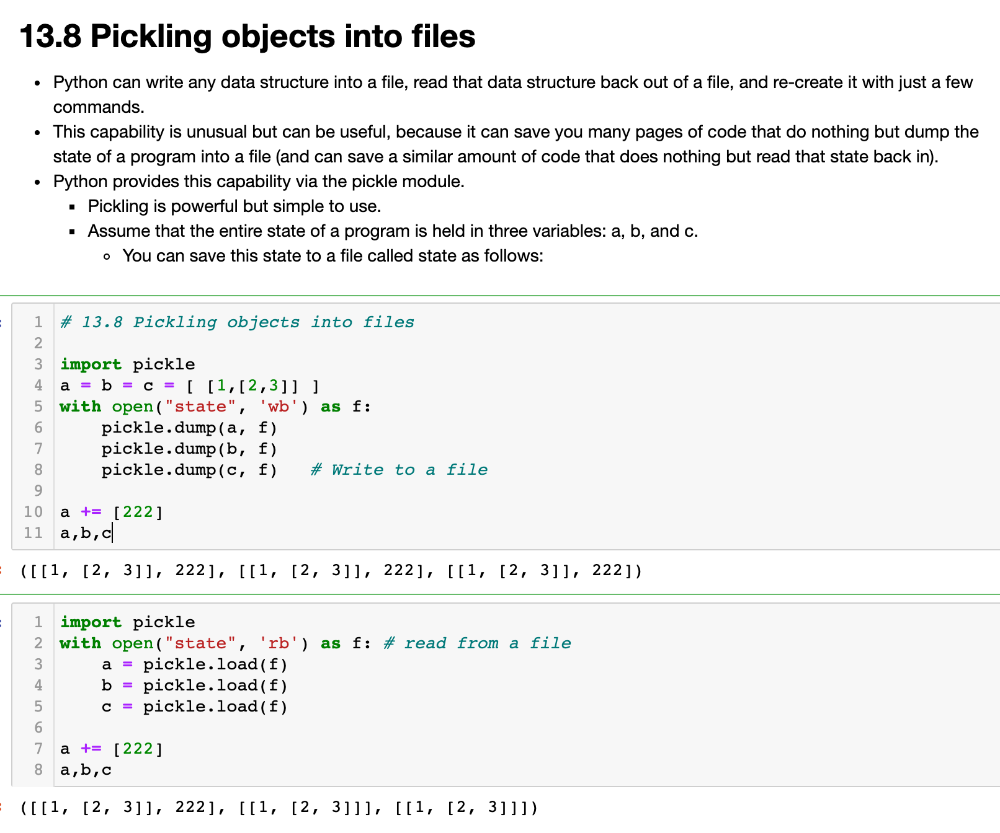

## Exceptions

```py
while (True):
    try:
        z = int ( input ("Please input an integer."))
        print (z)
        break
    # except ValueError as e :
    except:
        print ("Invalid input")
```


---

---

## Exception inheritance hierarchy

```py
KeyError.__base__
# LookupError

# Both KeyError and IndexError are subclasses of LookupError. 


# not good
try:
    d= {}
    x = d[0]
    
except LookupError as e: # more general than IndexError
    print ("1", type(e) ) 
except IndexError as e:
    print ("2", type(e) )
except KeyError as e:
    print ("3", type(e) )
# 1 <class 'KeyError'>    
```

---

## Defining new exceptions

```py
# 14.2.4 Defining new exceptions

class MyError(Exception):
    pass
class MyError2(Exception):
    def __str__(self):
        return "haha"

def test123(x):
    print ("\nx =",x)
    try:
        if x == 0:
            raise MyError ("x is too small")
        elif x ==1:
            [][0] = 1
        elif x ==2:
            raise MyError2 ("x is too big")
    except MyError as error:
        print( error )
    except MyError2 as error:
        print(  error )
    except IndexError :
        print("Index errors :")
    else: 
        print ("Everything is fine!")
    finally:
        print ( "Final step")


for i in [0,1,2]:
    test123(i)
# x = 0
# x is too small
# Final step

# x = 1
# Index errors :
# Final step

# x = 2
# haha
# Final step    
```

---


