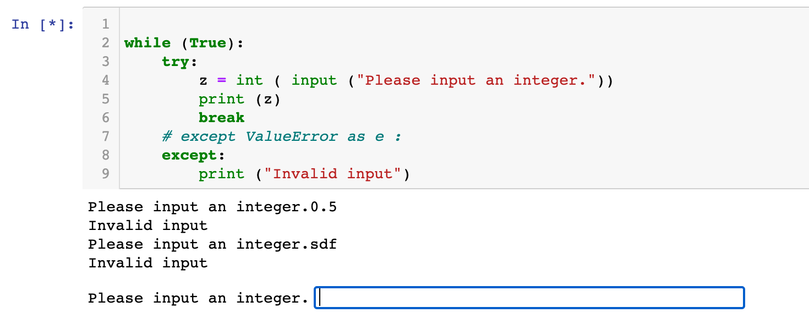

## Exceptions

```py
while (True):
    try:
        z = int ( input ("Please input an integer."))
        print (z)
        break
    # except ValueError as e :
    except:
        print ("Invalid input")
```



---