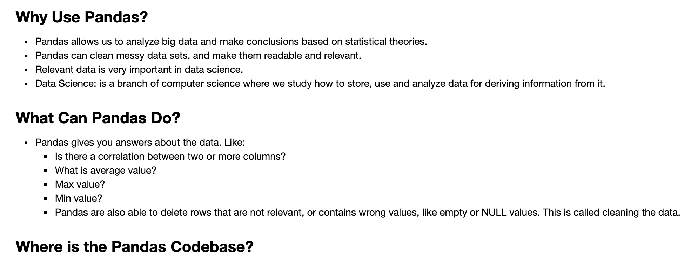
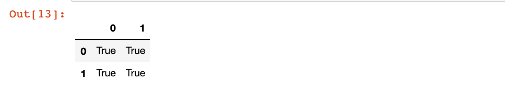

## What is Pandas?

- Pandas is a Python library used for working with data sets.
- It has functions for analyzing, cleaning, exploring, and 
  manipulating data
- The name "Pandas" has a reference to both "Panel Data", and 
  "Python Data Analysis" and was created by Wes McKinney 
  in 2008.




- [The source code for Pandas is located at this github repository](https://github.com/pandas-dev/pandas)

```py
import pandas as pd
A = [ [1,0], [0,1] ]
B = [ [1,2], [2,3] ]
A = pd.DataFrame (A)
B = pd.DataFrame (B)
C = A.dot (B)
C = A@B
C = A.__matmul__ (B)
A.__matmul__ (B) == A@B
```



---

```py
import pandas as pd 

def mul(X, Y):
    X = pd.DataFrame(X)
    Y = pd.DataFrame(Y)
    Z = X.dot(Y)
    print(Z)
    return Z.values.tolist()   
    # converted back to the python 2d list

X = [ [1,0], [0,1] ]
Y = [ [1,1], [1,0] ]
C = mul(X, Y)
C

#    0  1
# 0  1  1
# 1  1  0

# [[1, 1], [1, 0]]
```


