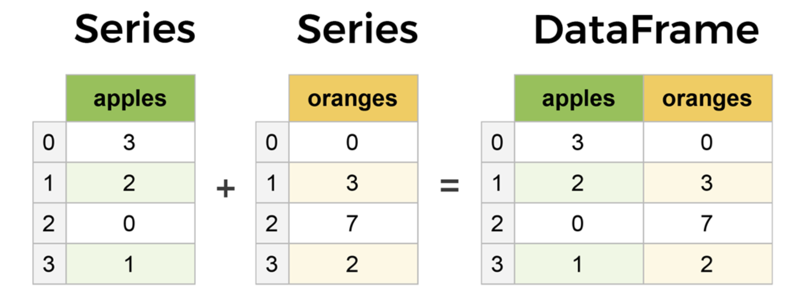
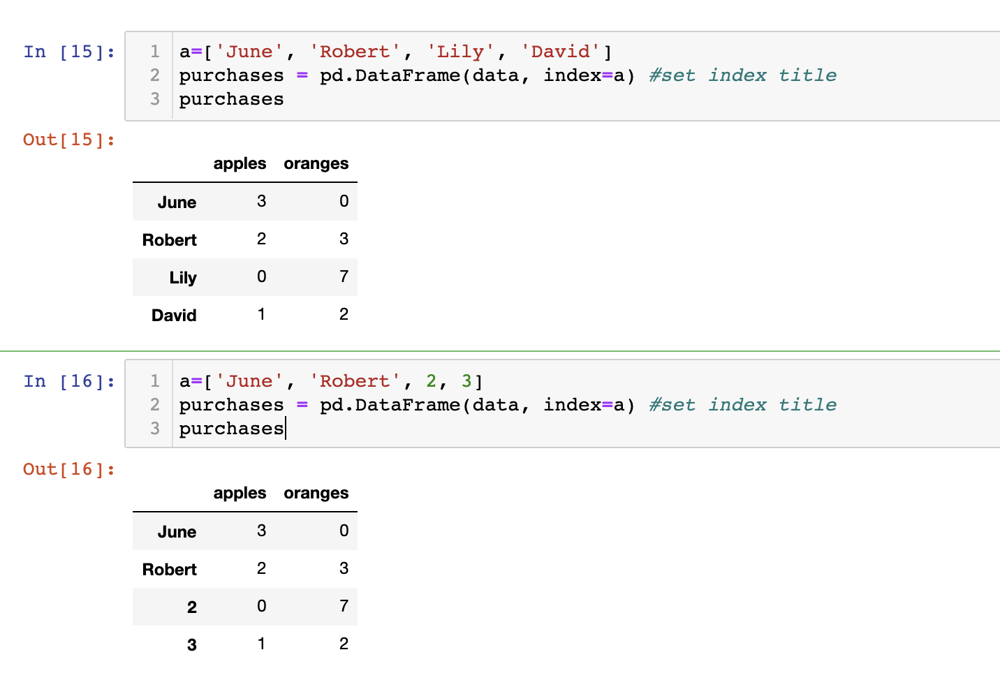
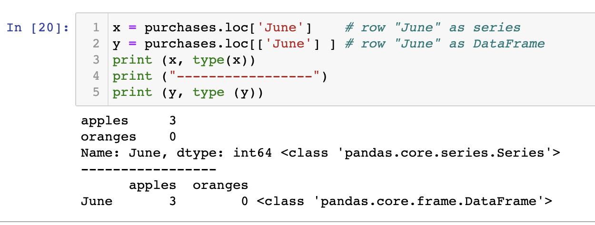
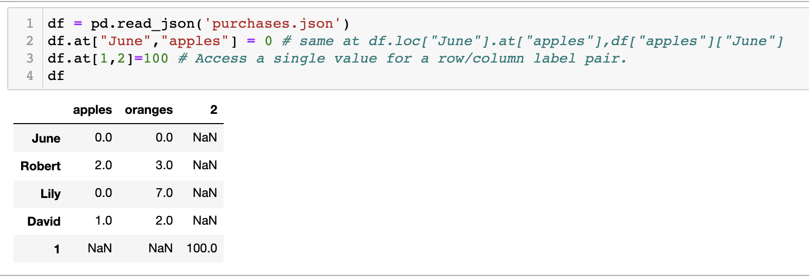
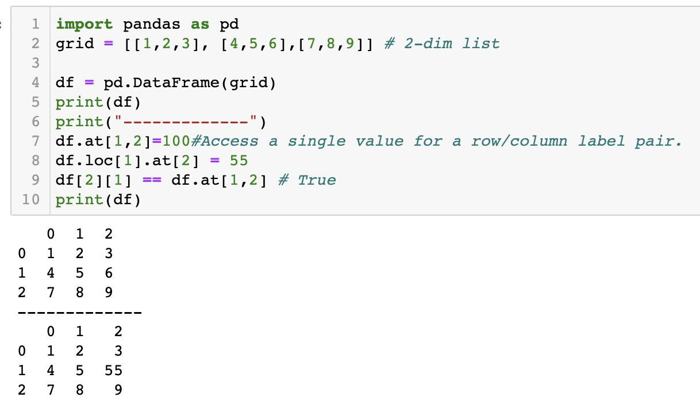
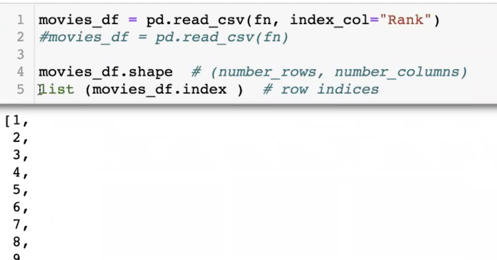

## Core components of pandas: Series and DataFrames

- The primary two components of pandas are the `Series` and 
  `DataFrame`.
  - A `Series` is essentially a `column`
  - a `DataFrame` is a `multi-dimensional` table made up of a 
    collection of `Series`.








-----




---



```py
df.loc[1].at[2] = 55 # row 2, column 2
df[2][1] = 55 # column 2, row 1
print(df)

#    0  1   2
# 0  1  2   3
# 1  4  5  55
# 2  7  8   9
```

---

