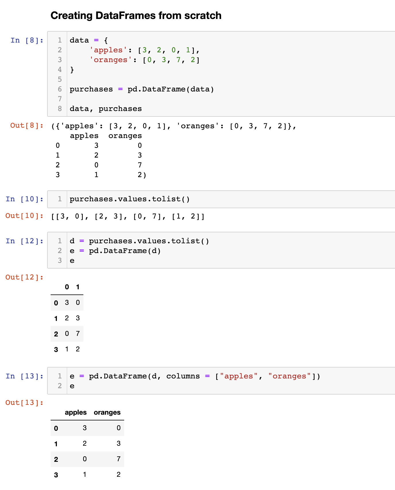

## Core components of pandas: Series and DataFrames

- The primary two components of pandas are the `Series` and 
  `DataFrame`.
  - A `Series` is essentially a `column`
  - a `DataFrame` is a `multi-dimensional` table made up of a 
    collection of `Series`.

