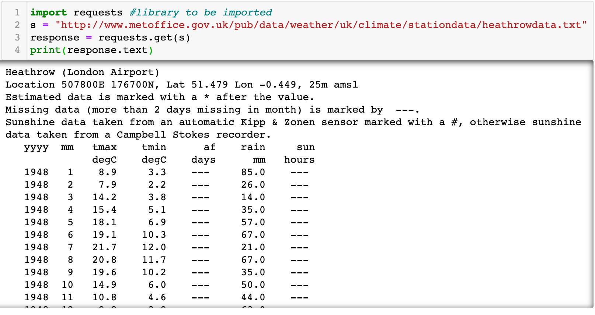
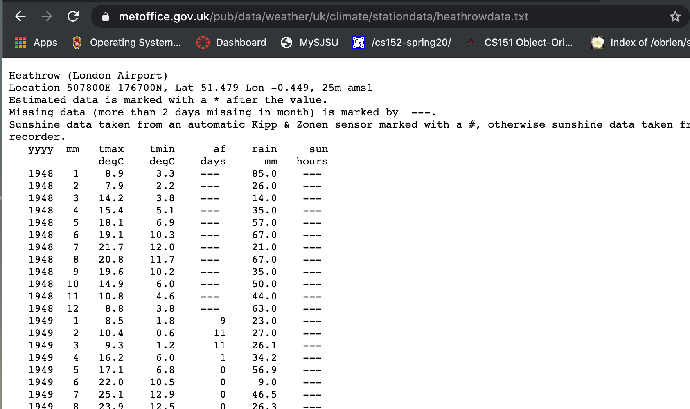

## Retrieving files over HTTP/HTTPS




---



```py
import requests
s ="http://www.metoffice.gov.uk/pub/data/weather/uk/climate/
stationdata/heathrowdata.txt"

response = requests.get(s)

data = response.text # a text file

data_rows = []
rainfall = []

for row in data.split("\r\n")[7:]: # skip the first 7 rows
    fields = [x for x in row.split(" ") if x]
    # fileds:  yyyy  mm   tmax    tmin      af    rain     sun
    data_rows.append(fields)
    rainfall.append(float(fields[5]))
    # field 5 is column rainfall

ave = sum(rainfall)/len(rainfall)
print("Average rainfall = {} mm".format(ave)) 
#Average rainfall = 50.43794749403351 mm
```


