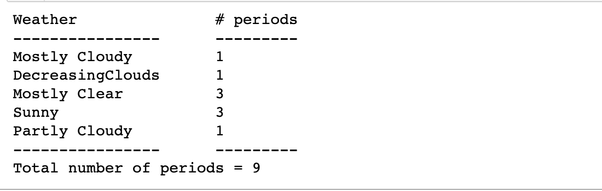

## Counting the frequencies in a list using dictionary


```py
# Python program to count the frequency of 
# elements in a list using a dictionary
  
def CountFrequency(my_list):
  
    # Creating an empty dictionary 
    freq = {}
    for item in my_list:
        if (item in freq):
            freq[item] += 1
        else:
            freq[item] = 1
  
    for key, value in freq.items():
        print ("% d : % d"%(key, value))
  
# Driver function
if __name__ == "__main__": 
    my_list =[1, 1, 1, 5, 5, 3, 1, 3, 3, 1, 4, 4, 4, 2, 2, 2, 
    2]
  
    CountFrequency(my_list)

#  1 :  5
#  2 :  4
#  3 :  3
#  4 :  3
#  5 :  2
```

---

```py
# xxx fill in your codes here

import requests
s = "http://forecast.weather.gov/MapClick.php?lat=37.7772&
lon=-122.4168"
page = requests.get(s)
# page.text
from bs4 import BeautifulSoup
soup = BeautifulSoup(page.content, 'html.parser')
# print(soup)

weather = {}
# a = soup.find_all('p')
a = soup.find_all('p', class_='short-desc')
for x in a:
#     print(x.get_text())
    key = x.get_text()
    if key in weather:
        weather[key] += 1
    else:
        weather[key] = 1

        
count = 0        
print("Weather               # periods")
print("----------------      ---------")
for key, value in weather.items():
    line = "{:18s}    {:^1d}".format(key, value)
    print(line)
    count += value
print("----------------      ---------")    
print("Total number of periods = {}".format(count))    
```



-----

```py
# xxx fill in your codes here
import requests
url ="http://www.metoffice.gov.uk/pub/data/weather/uk/climate/stationdata/heathrowdata.txt"

response = requests.get(url)

data = response.text # a text file

data_rows = []
rainfall = []
highest = 0
lowest = 0
Highest_Degree = float('-inf')
Lowest_Degree = float('inf')
high_year = {}
low_year = {}
rf = {}


for row in data.split("\r\n")[7:]: # skip the first 7 rows
    fields = [x for x in row.split(" ") if x]
    # fileds:  yyyy  mm   tmax    tmin      af    rain     sun
    data_rows.append(fields)
    rainfall.append(float(fields[5]))
    # field 5 is column rainfall
    key = int(fields[0])
    if key in high_year:
        high_year[key].append(float(fields[2]))
    else:
        high_year[key] = [float(fields[2])]
    
    if key in low_year:
        low_year[key].append(float(fields[3]))
    else:
        low_year[key] = [float(fields[3])]   
        
    if key in rf:
        rf[key].append(float(fields[5]))
    else:
        rf[key] = [float(fields[5])]           
        
    highest = max(highest, float(fields[2]))
    lowest = min(lowest, float(fields[3]))

ave = sum(rainfall)/len(rainfall)
print("Average rainfall = {:.1f} mm".format(ave)) 
print("The highest temparature in degree = {:.1f}".format
(highest))
print("The lowest temparature in degree = {:.1f}".format
(lowest))
print("Year Highest_Degree  Lowest_Degree    Rainfall")


for keyYear in high_year:
    high = max(high_year[keyYear])
    low = min(low_year[keyYear])
    avg = sum(rf[keyYear]) / len(rf[keyYear])
    line = "{:^5d}{:^15.1f}{:^15.1f}{:^15.1f}".format(keyYear, 
    high, low, avg)
    print(line)

```

