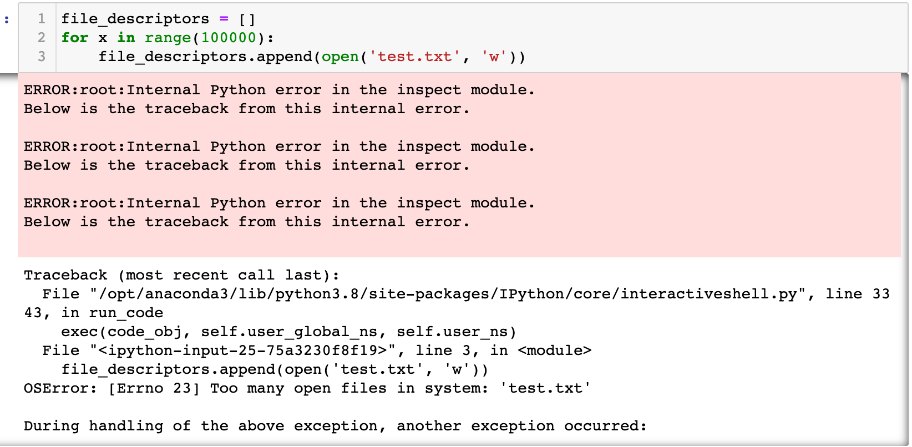

## Reading and writing files

```py
#13.2 Closing files

f = open("myfile", 'r')             # 
line = f.readline() # read a single line
f.close()                # file need to be closed explicitely


# What happen if files are not closed ????
# Memory (resource) leak


with open("myfile", 'r') as f:      # context manager
    line = f.readline()             # file closed automatically


f = open("myfile", 'r')             # 
line = f.readline() # read a single line
# f.close()           # file need to be closed explicitely
assert f.closed, "Memory Leak due to non-closed files"
# AssertionError: Memory Leak due to non-closed files


with open("myfile", 'r') as f:      # context manager
    for x in f: print(x)
# Hello, World

# Hello, World

# Hello, World

# Hello, World

# Hello, World

# Hello, World

# Hello, World

# Hello, World

# Hello, World

# Hello, World


with open("myfile", 'r') as f:
    line = f.readline()           # return next line from file
    while ( line != ""):
        print (line.strip() )     # remove "\n"
        line = f.readline()  
# Hello, World
# Hello, World
# Hello, World
# Hello, World
# Hello, World
# Hello, World
# Hello, World
# Hello, World
# Hello, World
# Hello, World       


with open("myfile", 'r') as f:
    [ print(x.strip()) for x in f]
# Hello, World
# Hello, World
# Hello, World
# Hello, World
# Hello, World
# Hello, World
# Hello, World
# Hello, World
# Hello, World
# Hello, World     


def read (fn = "myfile"):
    with open("myfile", 'r') as f: 
        [ print(x.strip() ) for x in f];

read()
# Hello, World
# Hello, World
# Hello, World
# Hello, World
# Hello, World
# Hello, World
# Hello, World
# Hello, World
# Hello, World
# Hello, World  


f = open("myfile", 'w')
for _ in range (10):
    f.write("xxx Hello \n")
f.close()   # remember to close the file


def read (fn = "myfile"):
    with open("myfile", 'r') as f: 
        [ print(x.strip() ) for x in f];

read ()
# xxx Hello
# xxx Hello
# xxx Hello
# xxx Hello
# xxx Hello
# xxx Hello
# xxx Hello
# xxx Hello
# xxx Hello
# xxx Hello


with open ("myfile", 'w') as f: 
    [f.write("xxx Hello\n") for _ in range(10)]


def read (fn = "myfile"):
    with open("myfile", 'r') as f: 
        [ print(x.strip() ) for x in f];

read ()
# xxx Hello
# xxx Hello
# xxx Hello
# xxx Hello
# xxx Hello
# xxx Hello
# xxx Hello
# xxx Hello
# xxx Hello
# xxx Hello


with open("myfile", 'r') as f: print ( len ( [x for x in f ]))
# 10


with open("myfile", 'r') as f: a  = [x for x in f ] 
with open("myfile", 'r') as f: b  = f.readlines() 

a == b
# True


with open("myfile", 'r') as f: a  = [x for x in f ] 
with open("myfile", 'r') as f: b  = f.readlines() 

c = []
with open("myfile", 'r') as f: 
    x = f.readline() 
    while x != "": 
        c.append(x) 
        x = f.readline()

a == b, a==c
# (True, True)
```

---

### 14.3 Context managers


```py
class Fruit:
    def __lt__(self, other):
        return id(self) > id(other)
        

x = Fruit(); y = Fruit()
a = [x,y]
a.sort()
print (a)
# [<__main__.Fruit object at 0x7fb986ddae50>, 
# <__main__.Fruit object at 0x7fb986ddad90>]
```




- if we open many times, error occurred


---

## Context managers

```py
# Python program showing 
# file management using  
# context manager 
  
class MyOpen(): 
    def __init__(self, filename, mode): # constructor
        self.filename = filename 
        self.mode = mode    
        # r for read,  w or write, a for append
        self.file = None
          
    def __enter__(self):    
        # invoked if object created by "with" keyword
        self.file = open(self.filename, self.mode) 
        return self.file
      
    def __exit__(self, exc_type, exc_value, exc_traceback): 
    # destructor
        self.file.close() 
  
# loading a file 

with MyOpen('test.txt', 'w') as f: # file object
    f.write('Test')
    
print(f.closed) 

with MyOpen('test.txt', 'r') as f: 
    x = f.read()
    print (x)
print(f.closed) 
# True
# Test
# True


# 14.3 Context managers


def myopen (fn):
    f = None
    try:
        with open (fn) as f:
            print ("open successfully!")
            # x = f.read()           # return a string
            # data = f.readlines()   # return a a list of strings
            # print (x)
        [][0]=1 # index error   
    except ZeroDivisionError as e :
        print ( e )
    except FileNotFoundError as e :
        print ( e )   
    except :
        print("Something happens! I have no idea")
    finally:
        if f:
            print ( "file closed = ", f.closed )

            
for fn  in ( "myfile", "nonexistent" ):
    myopen (fn)

            
for fn  in ( "myfile", "nonexistent" ):
    myopen (fn)

# open successfully!
# Something happens! I have no idea
# file closed =  True
# [Errno 2] No such file or directory: 'nonexistent'

```


