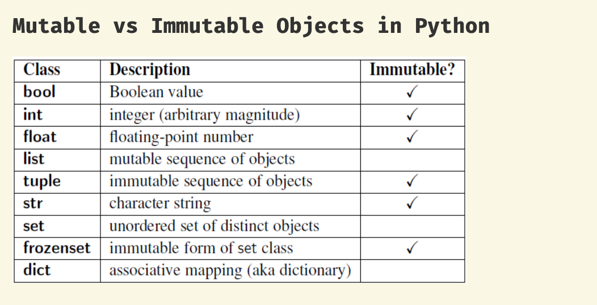
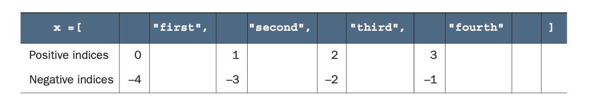
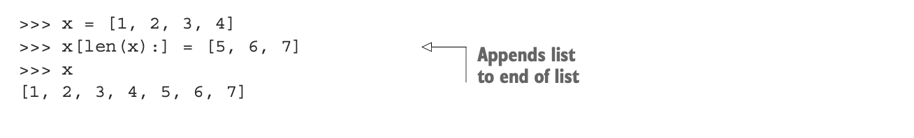
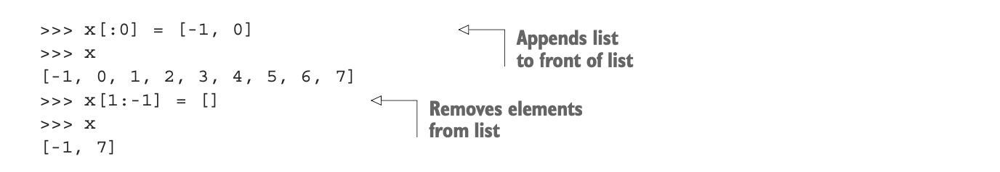

## Lists



```py
print (dir ([]) )
['__add__', '__class__', '__contains__', '__delattr__', '__delitem__', '__dir__', '__doc__', '__eq__', '__format__', '__ge__',
 '__getattribute__', '__getitem__', '__gt__', '__hash__', '__iadd__', '__imul__', '__init__', '__init_subclass__', '__iter__', 
 '__le__', '__len__', '__lt__', '__mul__', '__ne__', '__new__', '__reduce__', '__reduce_ex__', '__repr__', '__reversed__', '__rmul__', 
 '__setattr__', '__setitem__', '__sizeof__', '__str__', '__subclasshook__', 'append', 'clear', 'copy', 'count', 'extend', 'index', 
 'insert', 'pop', 'remove', 'reverse', 'sort']


help( [].copy )   # Return a shallow copy of the list.

Help on built-in function copy:

copy() method of builtins.list instance
    Return a shallow copy of the list.


a = [1,2,3]
b = a[:]  
# Omitting both indices makes a new list that goes from the beginning to the end of 
# the original list—that is, copies the list. 
# This technique is useful when you want to make a copy that you can modify without affecting the original list:
b

# [1, 2, 3]


b = a[0:len(a)]
b
# [1, 2, 3]


import copy
b = copy.copy(b)
print( b.__str__() )
print(str(b))

# [1, 2, 3]
# [1, 2, 3]


x = [1,2,3]
y = x.copy()           # a shallow copy of the list, same as y = x[:]
x *= 3                 # x = x*3
y.__imul__(3)          # overload *= 
y

# [1, 2, 3, 1, 2, 3, 1, 2, 3]


x = [1,2,3]
y = x*3               # y = x*3   
z = x.__mul__(3)      # overload *= 
y, y == z

# ([1, 2, 3, 1, 2, 3, 1, 2, 3], True)
```

---

## 05.1 Lists like arrays


```py
x = [2, "two", [1, 2, 3]]     # list is hetrogeneous
len(x)                        # same as x.__len__()
# 3


x.__len__()  # same as len(x)
# 3

print(len(x))
# 3


for i in x:
    print(i)
# 2
# two
# [1, 2, 3]


[1, 2, 3] in x  
x.__contains__([1,2,3])
# True
```


---


##  05.2 List indices

```py
x = ["first", "second", "third", "fourth"]
a = x[-1]
a                                          # 'fourth'

print( x.__getitem__(0) )
# first


x = ["first", "second", "third", "fourth"]
x[-2]                                      # 'third'
```



---

### Slicing n. 切断，切片；限制

- **slicing** Instead of entering `list[index]` to extract the item just after index, enter `list[index1:index2]` 
  to extract all items including `index1` and up to (but not including) `index2` into a new list.

```py
x = ["first", "second", "third", "fourth"]    
x[1:-1]                         # ['second', 'third']
x[0:3]                          # ['first', 'second', 'third']
x[-2:-1]                        # ['third']
```


- It may seem reasonable that if the second index indicates a position in the list before the first index, 
  this code would return the elements between those indices in reverse order, 
  but this isn’t what happens. Instead, this code returns an empty list:

```py
x = ["first", "second", "third", "fourth"]    
x[-1:2]                         # []
```


- When **slicing** a list, it’s also possible to leave out `index1` or `index2`. 
  - Leaving out index1 means “Go from the beginning of the list,” and 
  - leaving out index2 means “Go to the end of the list”:

```py
x = ["first", "second", "third", "fourth"]    

x[:3]                           # ['first', 'second', 'third']
x[2:]                           # ['third', 'fourth']
```


- Omitting both indices makes a new list that goes from the beginning to the end of the original list—that is, 
  copies the list. This technique is useful when you want to make a copy that you can modify 
  without affecting the original list:

```py
x = ["first", "second", "third", "fourth"]

y = x[:]
y[0] = '1 st'
y                              # ['1 st', 'second', 'third', 'fourth']
x                              # ['first', 'second', 'third', 'fourth']
```

---

### `reversed()` method returns an iterator that accesses the given sequence in the reverse order.

```py
x = [1, 2, 3]
y = reversed(x)
for i in y:
    print(i)

# 3
# 2
# 1


x = [1, 2, 3]
y = reversed(x)
for i in x:
    print(i)
# 1
# 2
# 3


x = [1, 2, 3]
y = reversed(x)
for i in reversed(x):
    print(i)
# 3
# 2
# 1
```

-----

## 05.3 Modifying Lists



```py
#  Lists are mutable
x = [1, 2, 3, 4];   
x[1] = "two";   
x                                    # [1, 'two', 3, 4]
# 
# 
x = [1, 2, 3, 4];    x[len(x):] = [5, 6, 7]  #  x += [5, 6, 7] 
x                                   # [1, 2, 3, 4, 5, 6, 7]


x[:0]  #  []

x   #  [1, 2, 3, 4, 5, 6, 7]
```





```py
x[:0] = [-1, 0]                     #   B
x                                   # [-1, 0, 1, 2, 3, 4, 5, 6, 7]

x[1:-1] = []                        #C 
x                                   # [-1, 7]


x = [1, 2, 3]; 
x.append("four"); 
x  # [1, 2, 3, 'four']


###############################################

# One problem can occur if you try to append one list to another. The list gets appended 
# as a single element of the main list:

x = [1, 2, 3, 4];  
y = [5, 6, 7]; 
x.append(y); 
x # [1, 2, 3, 4, [5, 6, 7]]
```

