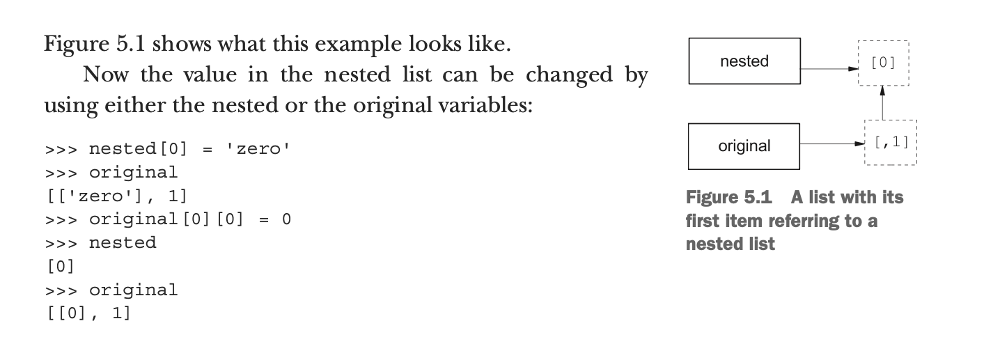

## Custom sorting

```py
word_list = ['Python', 'is', 'better', 'than', 'C']
word_list.sort()          # sort by the ascii code
print(word_list)                          
# ['C', 'Python', 'better', 'is', 'than']


def compare_num_of_chars(string1):
     return len(string1)

word_list = ['Python', 'is', 'better', 'than', 'C']
word_list.sort(key=compare_num_of_chars)
print(word_list)                           
# ['C', 'is', 'than', 'Python', 'better']
```

---

### sorted() function

```py
x = (4, 3, 1, 2)
y = sorted(x)
y                                # [1, 2, 3, 4] 
z = sorted(x, reverse=True)
z                                # [4, 3, 2, 1]

```

---

### operator

```py
# 05.5.2 + operator
# 
x = [1,2,3]
y = [4,5]
z = x + y    # same as z = [1, 2, 3].__add__ ( [4,5])
print (z)                    # [1, 2, 3, 4, 5]


import operator
operator.__add__ (x,y)


# 05.5.3 * operator
# 
z = [None] * 4
z
# [None, None, None, None]
# 
z = [3, 1] * 2      # same as z = [3,1].__mul__(2)
z                   # [3, 1, 3, 1]


#qqq
import operator  # https://docs.python.org/3/library/operator.html
z = [3, 1]
z *= 2
print (z)  
z = [3, 1]
z.__imul__ (2)         # same as z *= 2
print (z)              
z = [3, 1]
operator.__imul__ (z,2)
print (z)
z = [3, 1]
operator.imul (z,2)
print (z)
z = [3, 1]
z=operator.mul (z,2)
print (z)

# [3, 1, 3, 1]
# [3, 1, 3, 1]
# [3, 1, 3, 1]
# [3, 1, 3, 1]
# [3, 1, 3, 1]


x = [1,2,3]
y = x*3
z =x.__mul__(3)
z

# [1, 2, 3, 1, 2, 3, 1, 2, 3]
```

---

### min and max

```py
min([3, 7, 0, -2, 11]), min(3, 7, 0, -2, 11), min ( {2,3} )
# (-2, -2, 2)
```

---

### search with index()

```py
x = [1, 3, "five", 7, -2]
x.index(7)                              # 3
```

---


### matches with count

```py
x = [1, 2, 2, 3, 5, 2, 5]
x.count(2)                      # 3
x.count(5)                      # 2
x.count(4)                      # 0
```

-----


## Nested lists and deep copies

```py
m = [[0, 1, 2], [10, 11, 12], [20, 21, 22]]
m[0]                     # [0, 1, 2]
m[0][1]                  # 1
m[2]                     # [20, 21, 22]
m[2][2]                  # 22
nested = [0]
original = [nested, 1]
original 
# [[0], 1]
# 
# 
nested[0] = 'zero'
original                        # [['zero'], 1]
original[0][0] = 0
nested                          # [0]
original                        # [[0], 1]
# 
# 
nested = [2]
original                        # [[0], 1]
```



---


