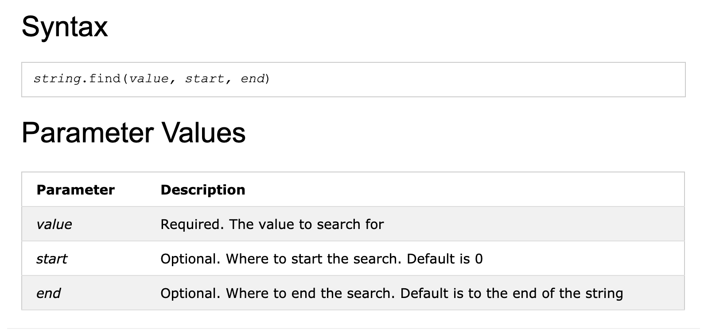

## String

```py
# Chapter 06.1
x = "Hello"
x[0]           # 'H'
x[-1]          # 'o'
x[1:]          # 'ello'
x.__getitem__(0)  # same as x[0]
for i in x:  # same as for i in x.__iter__():
    print (i)
help (x.format)


# H
# e
# l
# l
# o
# Help on built-in function format:

# format(...) method of builtins.str instance
#     S.format(*args, **kwargs) -> str
    
#     Return a formatted version of S, using substitutions # from args and kwargs.
#     The substitutions are identified by braces ('{' and '}# ').


x = "Goodbye\n"
x = x[:-1]
x
# 'Goodbye'
# 
# 
len(x)  # 7
x.__len__()   # same as the len("x)
# 7
```

---

### Basic String operations

```py
x = "Hello " + "World"
x = x.__add__("!!!  ")
x
# 'Hello World!!!  '


3 * x                      # 
x.__rmul__(3)

x * 3
x.__mul__(3)

# 'Hello World!!!  Hello World!!!  Hello World!!!  '
```

-----

### Numeric and Unicode escapes

```py
'm'          # 'm'
'\x6D'       # hex for 109
'\155'       # octal for 109
ord('m')


'\n'            # '\n'
'\012'          # octal for 10 
'\x0A'          # hex for 10
chr(10)          # '\n'
```

---

### Printing vs. evaluating strings with special characters

```py
'a\n\tb'                      # 'a\n\tb'
print('a\n\tb')
# a
#     b
# 
# 
print("abc\n")                    # abc
# 
print("abc\n", end="")            # abc
```

---

### split and join string methods

```py
" ".join(["join", "puts", "spaces", "between", "elements"])
# 'join puts spaces between elements'


"::".join(["Separated", "with", "colons"])   
# 'Separated::with::colons'


"".join(["Separated", "by", "nothing"])    
# 'Separatedbynothing'


x= "You\t\t can have tabs\t\n \t and newlines \n\n mixed in"
x.split()    
# ['You', 'can', 'have', 'tabs', 'and', 'newlines', 
# 'mixed', 'in']

x = "Mississippi"
x.split("ss")                 # ['Mi', 'i', 'ippi']
x = 'a b c d'
x.split(' ', 1)               # ['a', 'b c d']
x.split(' ', 2)               # ['a', 'b', 'c d']
x.split(' ', 9)               # ['a', 'b', 'c', 'd']


x="I              am a                student             ."
x.split()
# ['I', 'am', 'a', 'student', '.']


x="I              am a                student             ."
" ".join(x.split())
# 'I am a student .'


x="I              am a                student             ."
" ".join(x.split()[:-1]) +  x.split()[-1] 
# 'I am a student.'
```

-----

### Converting strings to numbers

```py
int('3333')                    # 3333
int('10000', 8)                   # 4096
int('101', 2)                     # 5
int('ff', 16)                     # 255
```

---

### Extra whitespace

- `strip()` Remove spaces at the beginning and at the end 
  of the string

- `lstrip()` Remove spaces to the left of the string:

- `rstrip()` Remove any white spaces at the end of the 
  string:

```py
x = "  Hello,    World\t\t "
x.strip()                     # 'Hello,    World'
x.lstrip()                    # 'Hello,    World\t\t '
x.rstrip()                    # '  Hello,    World'


x = "www.python.org"
x.strip("w")                       # '.python.org'
x.strip("gor")                     # 'www.python.'
x.strip(".gorw")                   # 'python'
x.strip(".worg")                   # 'python'
```

---

### Modifying strings

- Create a mapping table, and use it in the `translate()` 
  method to replace any "S" characters with a "P" character:

```py
x = "Mississippi"
x.replace("ss", "+++")        # 'Mi+++i+++ippi'


x = "~x ^ (y % z)"
table = x.maketrans("~^()", "!&[]")
x.translate(table)                  # '!x & [y % z]'
```

---

### String searching

- `find` takes one required argument: the substring being 
  searched for. find returns the position of the `first` 
  character of the first instance of substring in the 
  string object, or `–1` if substring doesn’t occur in the 
  string:



```py
x = "Mississippi"
x.find("ss")             # 2
x.find("zz")             # -1
# 
# 
x = "Mississippi"
x.find("ss", 3)          # 5
x.find("ss", 0, 3)       # -1
# 
# 
x = "Mississippi"        
x.rfind("ss")
# 5
# 
# 
x = "Mississippi"
x.count("ss")              # 2
# 
# 
x = "Mississippi"
x.startswith("Miss")       # True
x.startswith("Mist")       # False
x.endswith("pi")           # True
x.endswith("p")            # False


# return True if any one of them is found:
x.endswith(("i", "u"))     # True
```

---

### Modifying strings with list manipulations

- Because strings are immutable objects, you have no way to 
  manipulate them directly in the same way that you can 
  manipulate lists. Although the operations that produce 
  new strings (leaving the original strings unchanged) are 
  useful for many things, some- times you want to be able 
  to manipulate a string as though it were a list of 
  characters. In that case, turn the string into a list of 
  characters, do whatever you want, and then turn the 
  resulting list back into a string:

```py
text = "Hello, World"
wordList = list(text)
wordList

# ['H', 'e', 'l', 'l', 'o', ',', ' ', 'W', 'o', 'r', 'l', 'd']

wordList[6:] = []                    #A 
wordList.reverse() 
text = "".join(wordList)      
print(text) 
# ,olleH


# 06.4.7 Userful methods
# 
x = "123"
x.isdigit()       # True
x.isalpha()      # False
x = "M"
x.islower()     # False
x.isupper()      # True
```

---

### Converting from objects to strings

- `str()` and `repr()` both are used to get a string 
  representation of object.

```py
repr([1, 2, 3])              # '[1, 2, 3]'
x = [1]
x.append(2)
x.append([3, 4])
'the list x is'  + repr(x)    # 'the list x is [1, 2, [3, 4]]'
```


