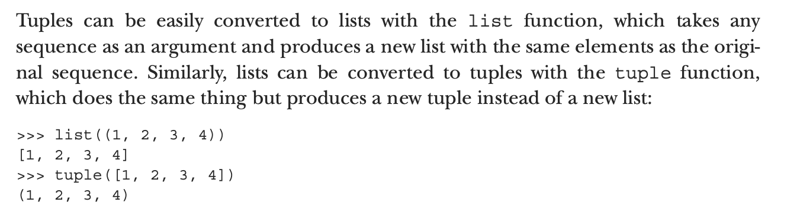

## Tuple packing

```py
# 05.7.3 Tuple packing
# 
(one, two, three, four) =  (1, 2, 3, 4)
one                    # 1
two                    # 2
# 
one, two, three, four = 1, 2, 3, 4
one                    # 1
two                    # 2


x = (1, 2, 3, 4)
a, b, *c = x
a, b, c                        # (1, 2, [3, 4])
a, *b, c = x
a, b, c                       # (1, [2, 3], 4)
*a, b, c = x
a, b, c                       # ([1, 2], 3, 4)
a, b, c, d, *e = x
a, b, c, d, e                 # (1, 2, 3, 4, [])
```

- To make things even more convenient, Python 3 has an 
  extended unpacking feature, allowing an element marked 
  with * to absorb any number of elements not matching the 
  other elements.

-----

### Converting between lists and tuples



- As an interesting side note, list is a convenient way to 
  break a string into characters:

```py
 list("Hello")
# ['H', 'e', 'l', 'l', 'o']
```


